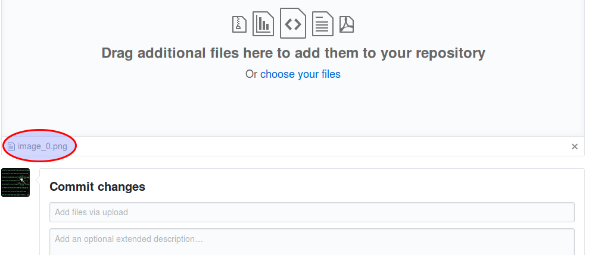

En estos pasos tomaremos los ficheros Markdown generados en el paso anterior y lo publicaremos a través de la plataforma Github. 

1. Iniciar sesión en GitHub. 

2. Crear un nuevo repositorio en [https://github.com/new](https://github.com/new)


3. Crear el fichero 01_Metadatos.md dentro del directorio docs/. Para hacerlo hace falta escribir como nombre de fichero "docs/01_Metadatos.md"


1. Pegar el contenido del documento recibido por en el correo electrónico. 


2. Guardar los cambios a través del botón "Commit new file". Opcionalmente se puede agregar una explicación de ha que se ha debido el cambio, principalmente para tener un histórico de las explicaciones de cara al futuro. 


3. Una vez se crea el fichero se verá el listado de ficheros. 


4. Para subir las imágenes podemos hacerlo con el boton "Upload file". 


5. En esta pantalla ya podremos subir los ficheros. 


6. Una vez subidos los veremos en esta pantalla, y una vez más debemos darle al botón de "Commit new file" 



7. Una vez subida la imagen podremos verla a través de la propia interfaz de Github. 


8. Continuar trabajando subiendo las imágenes y demás secciones. Podemos dividir el documento en distintas secciones siguiendo los nombres de "02_XXX.md". 

9. Yendo a la opción de "Settings", configurar el repositorio de Github para que genere el sitio de Github Pages a través del directorio docs/ 


10. En caso de que no tengamos el repositorio en local, lo clonaremos, instalaremos el daux y ejecutaremos el generador con el siguiente comando: 

```
# daux generate --source source/ --destination docs
```

11. Publicar a Github Pages usando git:

```
# git push origin master 
```


