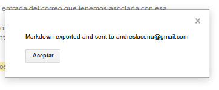

# 1. Elaboración: Google Drive 

En estos pasos convertiremos un documento de Google Drive (en formato ODT o DOC) a formato Markdown. 

1. Importar el documento en formato ODT o DOC en Google Drive. 

2. Instalar la extensión para Google Drive llamada "Export As Markdown"  [https://chrome.google.com/webstore/detail/export-as-markdown/hbojhdcnbcondcdfpfocpkjkfkbnbdad?utm_source=permalink](https://chrome.google.com/webstore/detail/export-as-markdown/hbojhdcnbcondcdfpfocpkjkfkbnbdad?utm_source=permalink) 

3. Abrir el documento.

4. Ir a Complementos, seleccionar "Export as Markdown", seleccionar “Email as attachment to yourself”.	

5. Ir a revisar la bandeja de entrada del correo que tenemos asociada con esa cuenta de Google, habremos recibido un correo con asunto "Markdown exported: Nombre del documento". En ese correo tendremos un fichero con extensión .md, junto con las imágenes que se hayan utilizado en ese documento.

El fichero Markdown es de texto plano, por lo que tendremos que abrirlo con herramientas como Notepad (bloc de notas), Notepad++, SublimeText, Atom, etc. 

