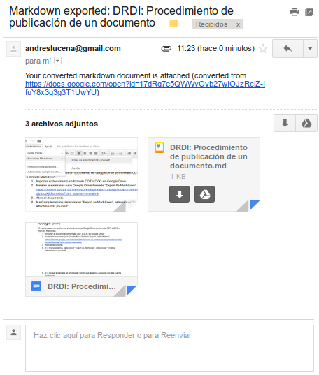

En aquests passos convertirem un document de Google Drive (en format ODT o DOC) a format Markdown.

1. Importar el document en format ODT o DOC en Google Drive.

2. Instal·lar l'extensió per Google Drive cridada "Export As Markdown" [https://chrome.google.com/webstore/detail/export-as-markdown/hbojhdcnbcondcdfpfocpkjkfkbnbdad?utm_source=permalink](https://chrome.google.com/webstore/detail/export-as-markdown/hbojhdcnbcondcdfpfocpkjkfkbnbdad?utm_source=permalink)

3. Obrir el document.

4. Anar a Complements, seleccionar "Export as Markdown", seleccionar “Email as attachment to yourself”.

5. Anar a revisar la safata d'entrada del correu que tenim associada amb aquest compte de Google, haurem rebut un correu amb assumpte "Markdown exported: Nom del document". En aquest correu tindrem un fitxer amb extensió .md, juntament amb les imatges que s'hagin utilitzat en aquest document.

El fitxer Markdown és de text pla, per la qual cosa haurem d'obrir-ho amb eines com Notepad (bloc de notes), Notepad++, SublimeText, Atom, etc.

6. Una vegada s'hagi exportat i es comença a treballar amb Makdown es recomana deixar de treballar en el Google Drive, ja que és molt esforç portar els canvis en els textos en els dos formats.
