En aquests passos prendrem els fitxers Markdown generats en el pas anterior i ho publicarem a través de la plataforma Github.

1. Iniciar sessió en GitHub.

2. Crear un nou repositori en [https://github.com/new](https://github.com/new)

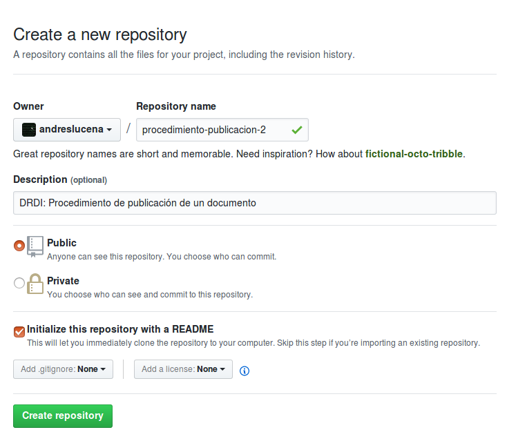

3. Crear el fitxer 01_metadatos.md dins del directori docs/. Per fer-ho fa falta escriure com a nom de fitxer "docs/01_metadatos.md"

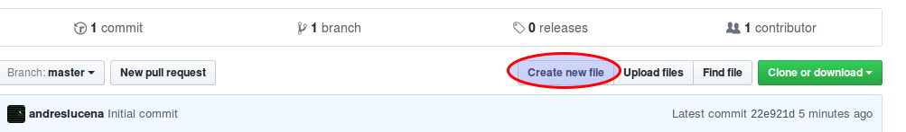

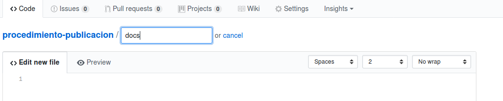

1. Pegar el contingut del document rebut per en el correu electrònic.

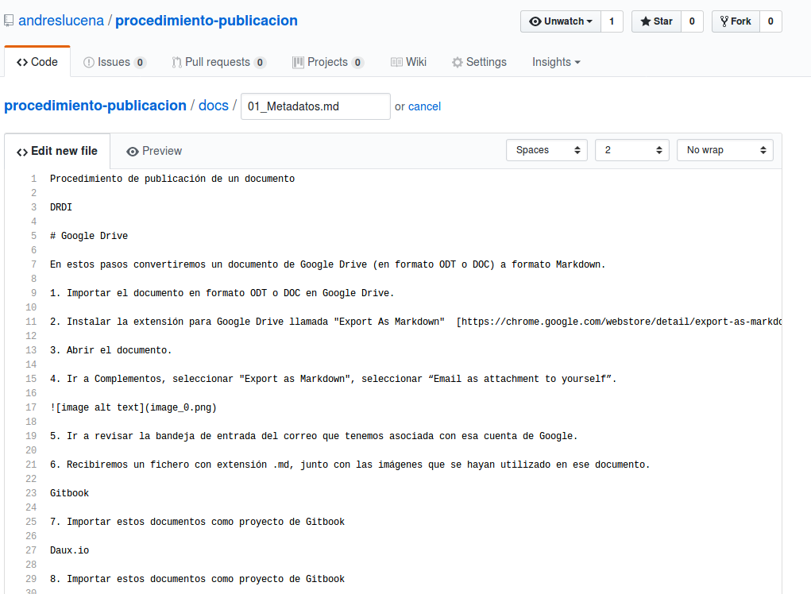

2. Guardar els canvis a través del botó "Commit new file". Opcionalment es pot agregar una explicació d'ha que s'ha degut el canvi, principalment per tenir un històric de les explicacions de cara al futur.

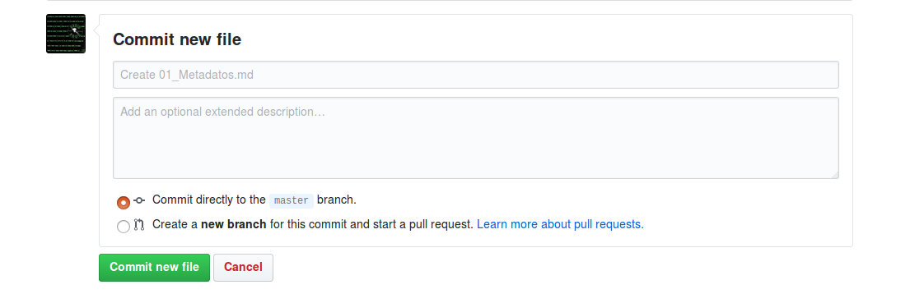

3. Una vegada es crea el fitxer es veurà el llistat de fitxers.

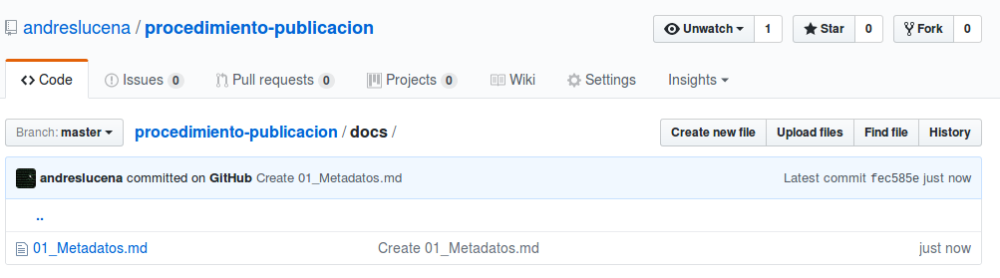

4. Per pujar les imatges podem fer-ho amb el boton "Upload file".

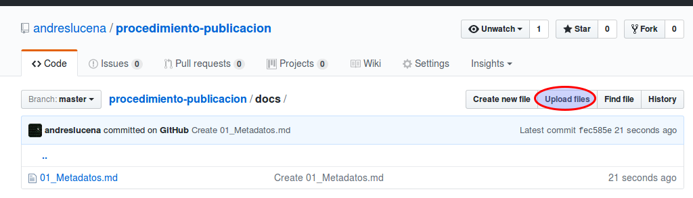

5. En aquesta pantalla ja podrem pujar els fitxers.

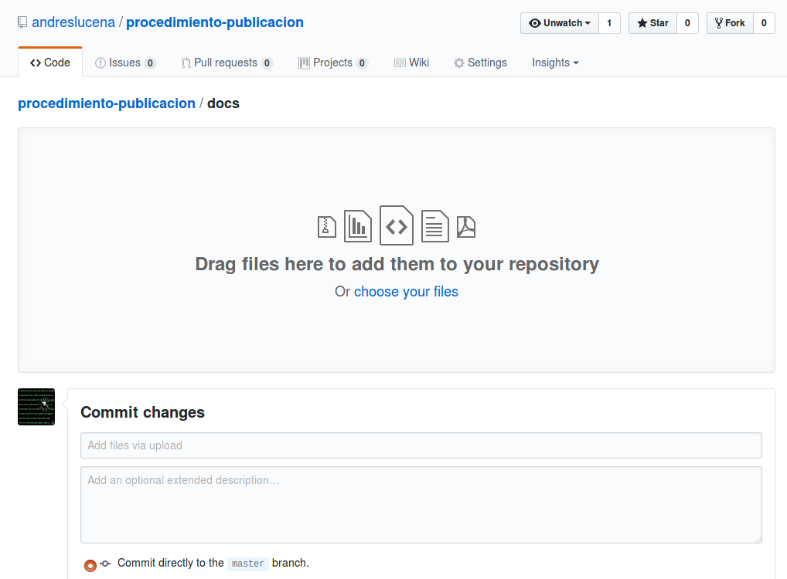

6. Una vegada pujats els veurem en aquesta pantalla, i una vegada més hem de donar-li al botó de "Commit new file"

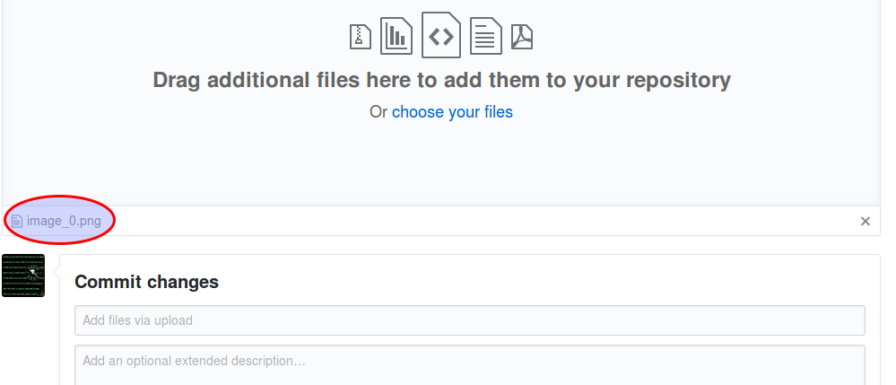

7. Una vegada pujada la imatge podrem veure-la a través de la pròpia interfície de Github.

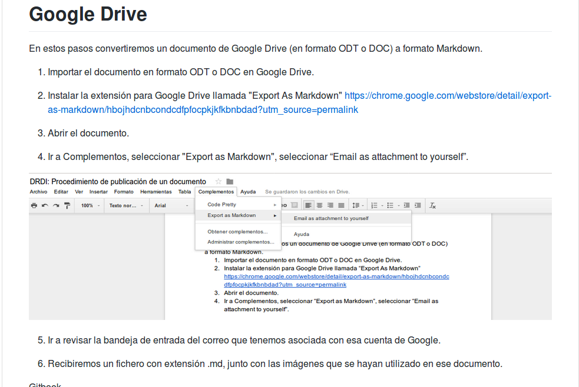

8. Continuar treballant pujant les imatges i altres seccions. Podem dividir el document en diferents seccions seguint els noms de "02_xxx.md".

9. Anant a l'opció de "Settings", configurar el repositori de Github perquè generi el lloc de Github Pages a través del directori docs/


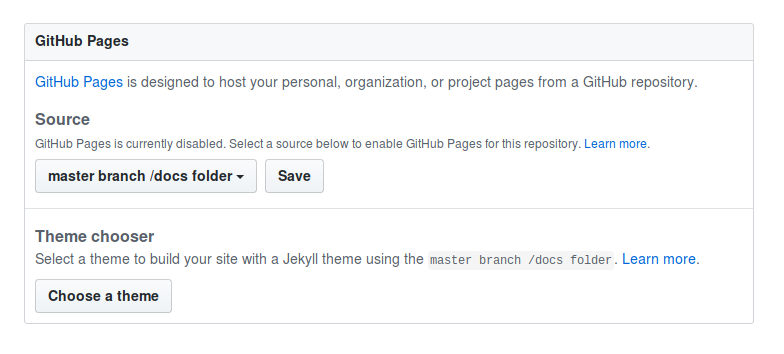

10. En cas que no tinguem el repositori en local, ho clonarem, instal·larem el daux i executarem el generador amb el següent comando:

```
# daux generate --source source/ --destination docs
```

11. Publicar a Github Pages usant git:

```
# git push origin master
```

12. Tenir en compte que per veure aquests canvis publicats en Github Pages han de passar diversos minuts per veure's reflectits.
